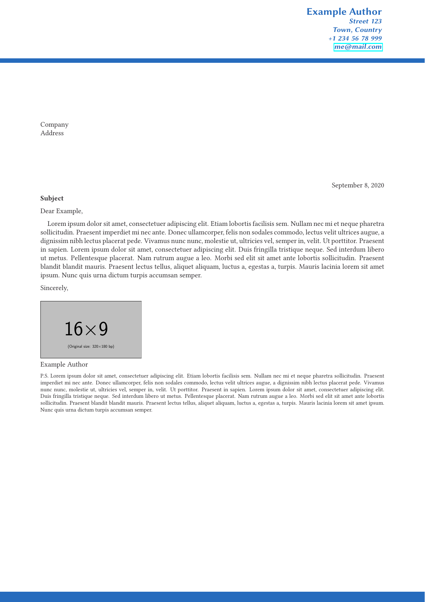

# polycv - A latex class for writing curriculum vitae

I previously used the package [koma-moderncvclassic](https://ctan.org/pkg/koma-moderncvclassic)
to prepare my CV, and I was actually quite satisfied with the look of it.
In a way this class borrows some design elements from it.
However, I noticed it was not using a lot of space, 
which got especially problematic when inserting a picture.

I looked through various templates and classes online
([limecv](https://github.com/opieters/limecv),
[simple academic resume](https://github.com/latex-ninja/simple-academic-resume),
[Deedy Resume](https://github.com/deedy/Deedy-Resume),
[Fancy CV by Adrien Friggeri](https://www.sharelatex.com/templates/cv-or-resume/fancy-cv),
[the Overleaf CV Gallery](https://www.overleaf.com/gallery/tagged/cv),
TeX Stack Exchange [LaTeX template for resume/curriculum vitae](https://tex.stackexchange.com/q/80/33413),
... , there are possibly some I forgot), 
but couldn't find anything that was exactly to my linking.
So I decided to write a class for myself, not just only for my CV,
but also for the training in writing such classes (or packages).

The main goal was to structure the information in a way that, 
if condensed enough, it would fit on one page; 
but additional pages could be added when the need arose, 
e.g. a long publication list, or many stations along the way.

Additionally I liked the idea of having a cover letter template,
which resembles most of the elements of the CV.

I am now at a stage where I consider it functional,
and ready to use by other people than me.

Here is one example of what is possible so far. 
You will surely notice some of the design elements from the list above.

  

## Usage

For a detailed description, please refer to the documentation, which is located in
[`doc/latex/polycv.pdf`](./doc/latex/polycv.pdf), or can alternatively be build from 
the source files.
Install the class file [`tex/latex/polycv.cls`](./tex/latex/polycv.cls) in a directory,
which is searched by latex, or alternatively, build it from the source files.
The [examples](./examples) directory contains a few template files.

If anything is unclear, needs improvement, is missing,
please submit an [issue](https://github.com/polyluxus/polycv/issues).
Thank you.

## Building the package

To compile the document class, simply run `pdflatex` on the `polycv.ins` source file in
[`source/latex`](./source/latex) and copy the resulting `polycv.cls` file to a 
directory searched by latex.

To compile the documentation, run `pdflatex` on  the `polycv.dtx` source file in the same
directory. To build the index and changes, run the following two lines:
```
makeindex -s gglo.ist -o polycv.gls polycv.glo
makeindex -s gind.ist -o polycv.ind polycv.idx
```
Run `pdflatex` on the source file, until no more warnings appear.

Both derived files are included for convenience in their respective directories.

