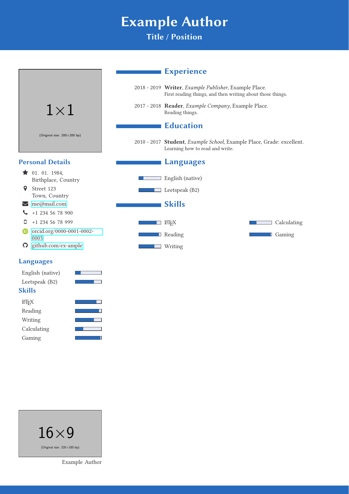
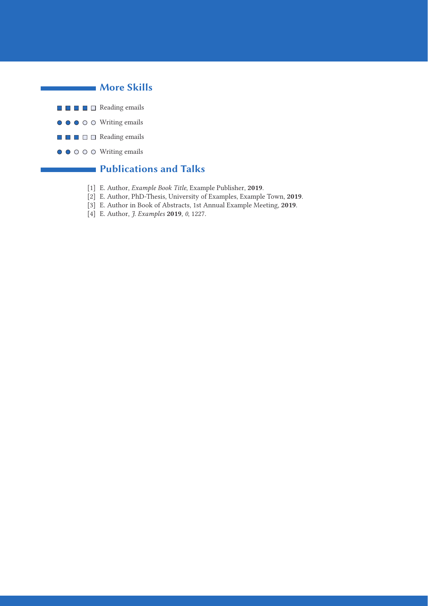

# polycv - A latex class for writing curriculum vitaes

*This is still a work in progress.*

I previously used the package [koma-moderncvclassic](https://ctan.org/pkg/koma-moderncvclassic)
to prepare my CV, and I was actually quite satisfied with the look of it.
In a way this class borrows some design elemnts from it.
However, I noticed it was not using a lot of space, 
which got especially problematic when inserting a picture.

I looked through various templates and classes online
(**insert a list here**), but couldn't find anything that was exactly to my linking.
So I decided to write a class for myself, not just only for my CV,
but also for the training in writing such classes (or packages).

The main goal was to structure the information in a way that, 
if condensed enough, it would fit on one page; 
but additional pages could be added when the need arose, 
e.g. a long publication list, or many stations along the way.

Additionally I liked the idea of having a cover letter template,
which resembles most of the elements of the CV.

I am now at a stage where I consider it functional,
but only in a proof of principle kind of way.
I'm still working on details, shuffling code around, 
some of it is implemented in a rather hacky way, 
and I would like to clean that up.  
There also is no documentation whatsoever of it at the moment.

Here is one example of what I have achievd so far. 
You will surely notice some of the dessign elements from the list above.

